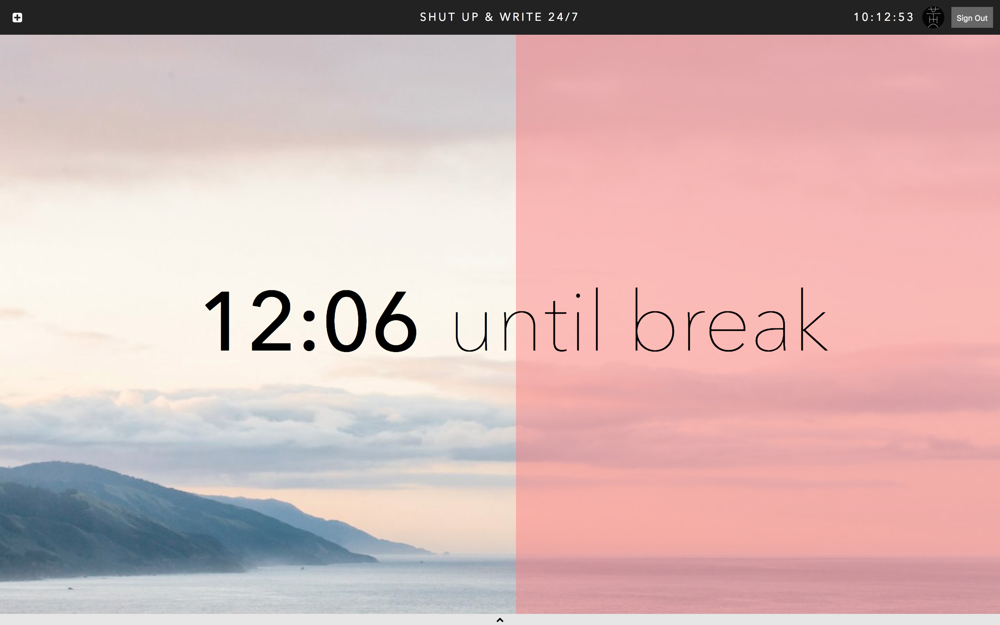

### [Live Demo](https://shutupandwrite247.firebaseapp.com/)

Collaborative pomodoro timer app.

Current features:
* Alternates between 25 minute work sessions and 5 minute break sessions
* Self-evaluate your productivity per session
* Multiple authentication providers
* Real-time data fetching
* Global notification system
* Full screen mode (drag-and-drop your own background image)

## TODO

### Features

* [x] Now
    * [x] Form
* [ ] Today
    * [x] Grid view of past form data
    * [ ] Expando to fetch comments
    * [ ] Endpoint: fetch by day, pagination sends a fetch
    * [ ] Mobile: list / card based layout (material design)
* [ ] Week
    * [ ] Visualizations
* [ ] Sessions
    * [ ] Grid view of most recent form data for all group members
        * [ ] MVP: All online users in same group
    * [ ] Expando to fetch comments
* [ ] User settings
    * [ ] Enable / disable alert notifications
    * [ ] Enable / disable notification sounds
    * [ ] Remove current background image
    * [ ] Close on form save
    * [ ] Open on alert
* [ ] Polyfills
    * [ ] Apparently `Audio` doesn't work on Safari
    * [ ] Apparently `Notification` doesn't work on Windows Chrome

### Data

* [ ] Session number: calculate on the fly in selector
* [ ] Session start time: add to reducer; pass
* [ ] Session end time: same

### UX

* [x] Drag and drop for background image
* [ ] Show spinner before user authentication (or all listeners)

### CRUD

* [ ] Posts
    * [x] Smart saving
        * Always be aware of most recent entry
        * If most recent entry `created_at` is before `state.nextCutoff`, update instead of create
        * If user has a valid post, break is about to end, and there is no active post, help user save their work
    * [x] Fetching posts
        * Can fetch all posts from a user
        * Can fetch most recent post from a user (for smart saving)

### Future Goals

* [ ] Sessions
    * Sessions can have many users
    * Posts should also belong to a session
    * Can fetch all posts from a session
    * "Scoreboard" display for all session members after every session
* [ ] User
    * [ ] Store most recent background in DB (TODO: good UX to delete background image)

## Credits

* Notification sounds from [FoolBoyMedia](https://freesound.org/people/FoolBoyMedia)
