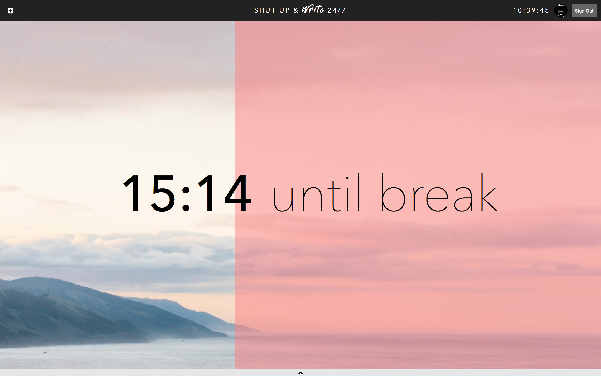

# Shut Up & Write 24/7

### [Live Demo](https://shutupandwrite247.firebaseapp.com/)

Collaborative pomodoro timer app.

Current features:
* Alternates between 25 minute work sessions and 5 minute break sessions
* Self-evaluate your productivity per session
* Multiple authentication providers
* Real-time data fetching
* Global notification system
* Full screen mode (drag-and-drop your own background image)

## TODO

* [x] Now
    * [x] Form
* [ ] Today
    * [ ] Grid view of past form data
    * [ ] Expando to fetch comments
* [ ] Week
    * [ ] Visualizations
* [ ] Sessions
    * [ ] Grid view of most recent form data for all group members
        * [ ] MVP: All online users in same group
    * [ ] Expando to fetch comments
* [ ] Visual enhancements
    * [x] Drag and drop for background image
    * [ ] Show spinner before user authentication (or all listeners)
* [ ] User settings
    * [ ] Option to enable / disable alert notifications
    * [ ] Option to enable / disable notification sounds
    * [ ] Option to remove current background image
* [ ] CRUD
    * [ ] Posts
        * [x] Smart saving
            * Always be aware of most recent entry
            * If most recent entry `created_at` is before `state.nextCutoff`, update instead of create
            * If user has a valid post, break is about to end, and there is no active post, help user save their work
        * [x] Fetching posts
            * Can fetch all posts from a user
            * Can fetch most recent post from a user (for smart saving)
* [ ] Future Goals
    * [ ] Sessions
        * Sessions can have many users
        * Posts should also belong to a session
        * Can fetch all posts from a session
        * "Scoreboard" display for all session members after every session
    * [ ] User
        * [ ] Store most recent background in DB (TODO: good UX to delete background image)

## Credits

* Notification sounds from [FoolBoyMedia](https://freesound.org/people/FoolBoyMedia)